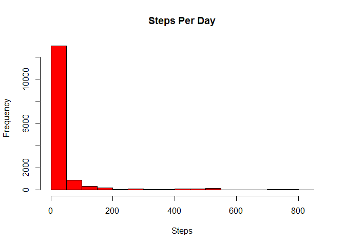
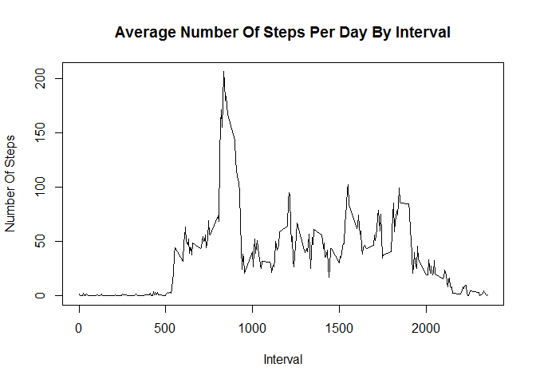
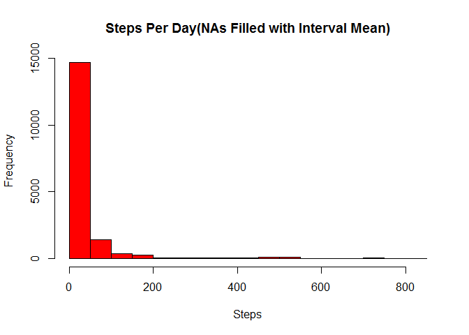
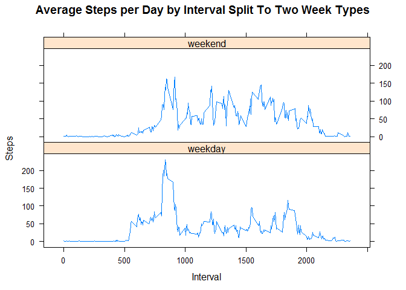

# Reproducible Research: Peer Assessment 1
By Jean Rafael Angeles

##Load required packages

```r
library(ggplot2)
```

```
## Warning: package 'ggplot2' was built under R version 3.1.2
```

```r
library(lattice)
```

## Loading and preprocessing the data
1. Load the data (i.e. `read.csv()`)

```r
gc()
```

```
##          used (Mb) gc trigger (Mb) max used (Mb)
## Ncells 447177 23.9     597831   32   531268 28.4
## Vcells 672330  5.2    1300721   10   905753  7.0
```

```r
data <- read.csv("activity.csv")
```

2. Process/transform the data (if necessary) into a format suitable for your analysis

```r
data$date <- as.Date(data$date)
```

## What is mean total number of steps taken per day?
1. Make a histogram of the total number of steps taken each day

```r
hist(data$steps, col="red", main="Steps Per Day" , xlab="Steps")
```

 

2. Calculate and report the **mean** and **median** total number of steps taken per day

```r
mean(data$steps,na.rm=TRUE)
```

```
## [1] 37.38
```

```r
median(data$steps,na.rm=TRUE)
```

```
## [1] 0
```

## What is the average daily activity pattern?
1. Make a time series plot (i.e. `type = "l"`) of the 5-minute interval (x-axis) and the average number of steps taken, averaged across all days (y-axis)

```r
StepsByInterval <- aggregate(steps ~ interval, data, mean)

plot(StepsByInterval$interval,StepsByInterval$steps, type="l", xlab="Interval", ylab="Number Of Steps",main="Average Number Of Steps Per Day By Interval")
```

 

2. Which 5-minute interval, on average across all the days in the dataset, contains the maximum number of steps?

```r
StepsByInterval[which.max(StepsByInterval$steps),1]
```

```
## [1] 835
```

## Imputing missing values
1. Calculate and report the total number of missing values in the dataset (i.e. the total number of rows with `NA`s)

```r
sum(is.na(data))
```

```
## [1] 2304
```

2. Devise a strategy for filling in all of the missing values in the dataset. The strategy does not need to be sophisticated. For example, you could use the mean/median for that day, or the mean for that 5-minute interval, etc.

- The missing values will be filled with the mean for the 5-minute interval.


3. Create a new dataset that is equal to the original dataset but with the missing data filled in.

```r
data <- merge(data, StepsByInterval, by = "interval", suffixes = c("", ".fill"))
data$steps[is.na(data$steps)] <- data$steps.fill[is.na(data$steps)]
data$steps.fill <- NULL
```

4. Make a histogram of the total number of steps taken each day and Calculate and report the **mean** and **median** total number of steps taken per day. Do these values differ from the estimates from the first part of the assignment? What is the impact of imputing missing data on the estimates of the total daily number of steps?

```r
hist(data$steps, col="red", main="Steps Per Day(NAs Filled with Interval Mean)" , xlab="Steps")
```

 

```r
mean(data$steps,na.rm=TRUE)
```

```
## [1] 37.38
```

```r
median(data$steps,na.rm=TRUE)
```

```
## [1] 0
```

- No change is to be seen as the imputed value is based on the value of the interval mean.


## Are there differences in activity patterns between weekdays and weekends?
1. Create a new factor variable in the dataset with two levels -- "weekday" and "weekend" indicating whether a given date is a weekday or weekend day.

```r
DayOfTheWeek <- function(date) {
    if (weekdays(as.Date(date)) %in% c("Saturday", "Sunday")) "weekend" else "weekday"
}

data$WeekType <- as.factor(sapply(data$date, DayOfTheWeek))
```

2. Make a panel plot containing a time series plot (i.e. `type = "l"`) of the 5-minute interval (x-axis) and the average number of steps taken, averaged across all weekday days or weekend days (y-axis). The plot should look something like the following, which was created using **simulated data**:


```r
StepsByIntervalByWeekType <- aggregate(steps ~ interval + WeekType, data, mean)

xyplot(StepsByIntervalByWeekType$steps ~ StepsByIntervalByWeekType$interval|StepsByIntervalByWeekType$WeekType, main="Average Steps per Day by Interval Split To Two Week Types",xlab="Interval", ylab="Steps",layout=c(1,2), type="l")
```

 

- There is a difference in the pattern of activity between weekdays and weekends.
